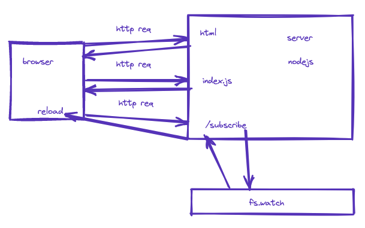

В это маленьком проекте мы знакомимся с тем как работает сервер на nodejs
Для примера мы берем реализацию автобновления страницы при изменении исходников


Исследуем подход https://learn.javascript.ru/long-polling

Запуск проекта
```
node server.js
```
